# Generative AI Application Using Your Own Data

## Estimated Duration: 60 Minutes

## Lab Overview

Retrieval Augmented Generation (RAG) is a design pattern that enables AI developers in Azure to build intelligent applications by combining large language models with organization-specific data. Instead of relying only on the model’s pre-trained knowledge, RAG retrieves relevant information from custom data sources—such as documents, databases, or knowledge bases—and incorporates it into the prompt to generate more accurate, context-aware responses. This approach is widely used for developing chat-based and enterprise AI applications. In this exercise, AI developers will use Microsoft Foundry within Azure to integrate custom data into a generative AI solution, enabling more reliable and domain-specific outputs.

## Lab Objectives

In this exercise, you will be able to complete the following tasks:

- Task 1: Provision Microsoft Foundry Hub and Project
- Task 2: Deploy a Model
- Task 3: Use Prompt Engineering in the Playground
- Task 4: Create a RAG application
- Task 5: Run the RAG application

## Task 1: Provision Microsoft Foundry Hub and Project

To use the Foundry features in this task, you must first create a project that is built on a Foundry hub resource. The hub acts as the central resource that manages shared services such as model access, connections, and security. Once the hub is created, projects linked to it can access these capabilities and allow you to build, manage, and deploy your AI solutions.


1. In a new window browser, navigate to the **Microsoft Foundry** portal at `https://ai.azure.com` and Click on **Sign in to get started (1)**. 

    

    >**Note**: Close any tips or quick start panes that are opened the first time you sign in, and if necessary use the Foundry logo at the top left to navigate to the home page, which looks similar to the following image (close the Help pane if it’s open).

1. Once after the login is succeeded, you should see the Home page of the **Microsoft Foundry**.

    

1. Navigate to `https://ai.azure.com/managementCenter/allResources`. 

    

1. Select **Create new (1)**, then choose the option to create a new **AI hub resource (2)** then select **Next (3)**.

    

    

1. In the **Create a new project** wizard, enter **aiproject-<inject key="DeploymentID" enableCopy="false" />(1)** for your project. Select the option **Rename hub (2)** to create a new hub. 

    

1. Enter **aihub-<inject key="DeploymentID" enableCopy="false" /> (1)** name for your new hub and click on **Next (2)**.

    

1. Expand **Advanced options (1)**, and set the following settings for your project:

    - **Subscription**: Use an existing Azure subscription **(2)**
    - **Resource group**: Select **openai-<inject key="DeploymentID" enableCopy="false" /> (3)**
    - **Region**: Select **East US2 / Sweden Central (4)**
    - **Foundry or Azure OpenAI**: Click on **Create new Foundry (5)**, provide name as **aifoundry-<inject key="DeploymentID" enableCopy="false" /> (6)** and click on **ok(7)**
    - Click on **Create (8)**

     

1. Now lets wait for your project to be created.

    

1. Once the project is successfully created, you will be automatically navigated to the overview page of the **aiproject- <inject key="DeploymentID" enableCopy="false" />**.

    

## Task 2: Deploy a model

In this task, you will configure two models within your Azure Foundry project to implement a Retrieval Augmented Generation (RAG) solution. First, you will use an embedding model to convert your custom text data into vector representations, enabling efficient indexing and retrieval of relevant information. Then, you will use a generative language model to process the retrieved data and generate accurate, context-aware natural language responses. Together, these models enable your solution to deliver intelligent answers grounded in your organization’s data.

1. In **aiproject- <inject key="DeploymentID" enableCopy="false" />** inside the **Micrsoft Foundry**, select **Model catalog** from the navigation pane on the left.

     

1. On the filter panel, select the **Collections (1)** and check the box fror **Azure OpenAI (2)** to filter by Azure OpenAI collections only.

    

1. Search for **gpt-4.1(1)**, select it **(2)**. On the detail page select **Use this model (3)**.

    

    

1. There will be a pop-up with purchase options appears, select the **Direct from Azure models** option.

    

1. Use the following settings in the **Deploy model wizard** and then click on **Deploy**:

    - **Deployment name**: **`gpt-4.1` (1)**
    - **Deployment type**: **`Global Standard` (2)**
    - In order to edit the Deployment details click on **Customize (3)**.

        

    - **Model version**: **`2025-04-14(Default)`(4)**
    - **Connected AI resource**: **`Select the resource created previously` (5)**
    - **Tokens per Minute Rate Limit (thousands)**: **`10k` (6)**
    - **Content filter**: **`DefaultV2` (7)**

        
    
    > **Note:** If your current AI resource location doesn’t have quota available for the model you want to deploy, you will be asked to choose a different location where a new AI resource will be created and connected to your project.

    > **Note:** Reducing the Tokens Per Minute (TPM) helps avoid over-using the quota available in the subscription you are using. 10,000 TPM is sufficient for the data used in this exercise.

1. Now lets return to the **Models catalog (1)** page, Make sure the collection is set to **Azure OpenAI (2)**  search and select for **text-embedding-ada-002 (3)**.On the detail page select **Use this model (4)**.

    

    

1. There will be a pop-up with purchase options appears, select the **Direct from Azure models** option.

    

1. Use the following settings in the **Deploy model wizard** and then click on **Deploy**:

    - **Deployment name**: **`text-embedding-ada-002` (1)**
    - **Deployment type**: **`Global Standard` (2)**
    - In order to edit the Deployment details click on **Customize (3)**.

        

    - **Model version**: **`2(default)`(4)**
    - **Connected AI resource**: **`Select the resource created previously` (5)**
    - **Tokens per Minute Rate Limit (thousands)**: **`10k` (6)**
    - **Content filter**: **`DefaultV2` (7)**

        
    
    > **Note:** If your current AI resource location doesn’t have quota available for the model you want to deploy, you will be asked to choose a different location where a new AI resource will be created and connected to your project.

1. Once the models are deployed, on the left navigation click on **Models + Endpoints (1)** and view the newly deployed models **(2)**.

    

## Task 3: Use Prompt Engineering in the Playground

Before using your index in a RAG-based prompt flow, let’s verify that it can be used to affect generative AI responses.

1. In the navigation pane on the left, select the **Playgrounds (1)** page and click on the **Try the Chat playground (2)**.

    

1. On the **Chat playground** page, in the Setup pane, ensure that your **gpt-4.1 [version:2025-04-14 (Default)](1)** model deployment is selected. 

    

1. Then, in the main chat session panel, enter the prompt 
    ```
    Where can I stay in New York?
    ```
    

1. Review the response, which should be a generic answer from the model without any data from the index.

    

1. In the **System message field (1)**, enter the following prompt and click on **Apply Changes (2)**,then click on **Continue (3)** on update system message wizard:

    ```
    You are a travel assistant that provides information on travel services available from Margie's Travel.

    ```
    
    

1. In the chat window, enter the same query and review the response.

    ```
    Where can I stay in New York?
    ```
1. Lets give a try with another prompt as below and observe how the model responds without grounding data.

    ```
    What destinations does Margie's Travel offer?
    ```
    

## Task 3: Add grounding data in the playground

In this task, you will add data to your Azure Foundry project to support your generative AI application. The dataset consists of travel brochures in PDF format from the fictitious travel agency Margie’s Travel. You will upload these documents to the project so they can be indexed and used as a custom data source. This step ensures that the AI solution can retrieve relevant information from the brochures and generate accurate, context-aware responses based on their content.

1. Open **File Explorer 📁 (1)** which is pinned to the task bar and Navigate to `C:\labfiles`. 

    

1. Navigate to **`C:\labfiles` (1)**. Create a new folder **📁New Folder (2)** and name it as **brochures (3)**.

    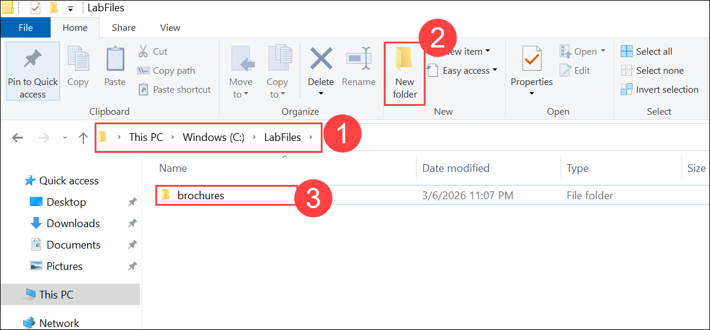

1. In a new browser tab, download the zipped archive of brochures on to the **LabVM**.
    ```
    https://github.com/MicrosoftLearning/mslearn-ai-studio/raw/main/data/brochures.zip 
    ```
1. Open downloaded folder location **📁(1)**.Extract it to a folder named **brochures** on LabVM i.e,`C:\labfiles\brochures` **(2)** then **extract (3)**.

    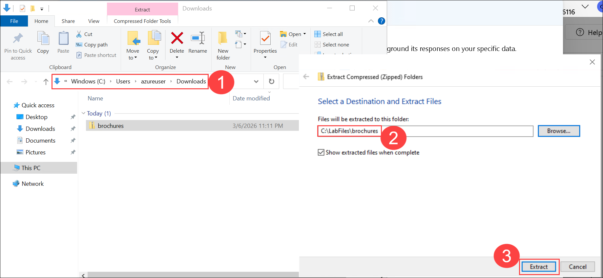

1. Navigate back to the Foundry portal, on the Chat Playground wizard in **Add your data (1)** section click on **+Add new data source (2)**.

    

1. In the **Add your data** wizard, add a new index with the following settings:

    - **Source data**:

        - **Data source**: **`Upload files` (1)**.
        - Click on **`Upload`(2)** 
            
            

        - On the File explorer dialogue, Select the all the files from **`brochures`** folder as data source.

            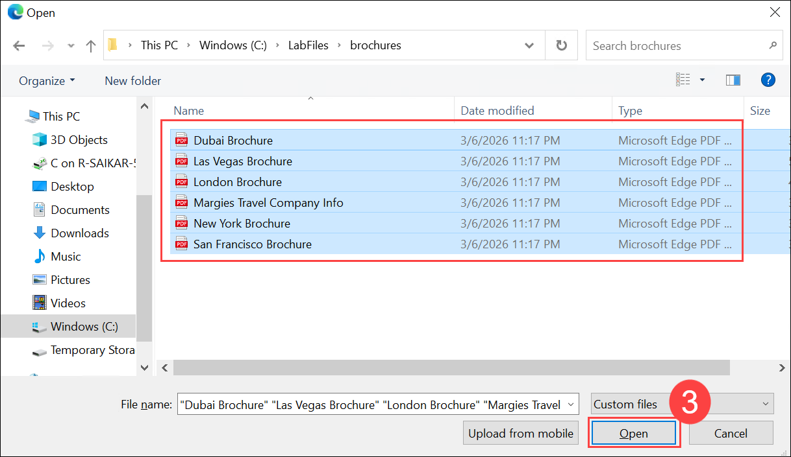

        - Click on **`Next`**.

            
            
    - **Index configuration**:

        - **Select Azure AI Search Service**: **`Create a new Azure AI Search resource`**.
        
            

            > **Note**: This will redirect you to the Azure Portal

        - Provide the following details to create Azure AI Search Service:

            - **Subscription**: Choose the Default Azure subscription **(1)**
            - **Resource group**: Select **openai-<inject key="DeploymentID" enableCopy="false" /> (2)**
            - **Service name**: Name the resource name as **aisearch-<inject key="DeploymentID" enableCopy="false" /> (3)**
            - **Location**: Use the same location as your AI hub resource **(4)**
            - **Pricing tier**: Make sure **Basic (5)** is selected
            - Click on **Review + Create (6)** and then **Create**.

            

            

1. Wait for the **AI Search** resource to be created. 

    

1. Lets return to the **Create a vector index** wizard in Microsoft Foundry, click on the drop down of **Select Azure AI Search service** and select **Connect other Azure AI Search (1)** resource and adding a connection to the AI Search resource you just created by clicking on **Add Connection (2)**.

    

    

1. Once the AI search connection is established, from the drop down select **aisearch-<inject key="DeploymentID" enableCopy="false" />**

    - Vector index: **`brochures-index` (1)**
    - Virtual machine: **`Auto select`(2)**
    - Click on **Next (3)**

        

    - **Search settings**:
        - **Vector settings**: Make sure the checkbox is checked for **`Add vector search to this search resource`(3)**
        - **Azure OpenAI connection**: Select the default Azure OpenAI resource for your hub **(4)**.
        - **Embedding model**: **`text-embedding-ada-002`** **(5)**
        - Embedding model deployment: **`text-embedding-ada-002`** **(6)**
        - Click on **Next (7)**

        
    - **Review and Create** : Click on **`Create vector index`** **(8)**

        

1. Wait for the indexing process to be completed, which can take a while depending on available compute resources in your subscription.

1. The index creation operation consists of the following jobs:

    - Crack, chunk, and embed the text tokens in your brochures data.
    - Create the Azure AI Search index.
    - Register the index asset.

## Task 4: Creating RAG application


1. On the **Microsoft Foundry** portal, go to the Overview page for your project.

1. Find the Foundry endpoint displayed on the welcome screen (for example, https://<your-resource>.services.ai.azure.com/api/projects/<your-project>). Copy this endpoint — you’ll use it to connect to your model.

    > **Note**: The Microsoft Foundry SDK handles authentication and endpoint routing automatically when you use AIProjectClient.get_openai_client(). Make a note of this endpoint.

1. Open **Visual Studio Code** that is located on the Desktop. 

1. Open a **Terminal (1)** in VS Code then click on **New Terminal(2)** and clone the GitHub repo containing the code files for this exercise:

    ```
    cd C:\labfiles

    git clone https://github.com/microsoftlearning/mslearn-ai-studio mslearn-ai-foundry
    ```
    > **Note**: If the Terminal option is not visible click on **(...)**.

    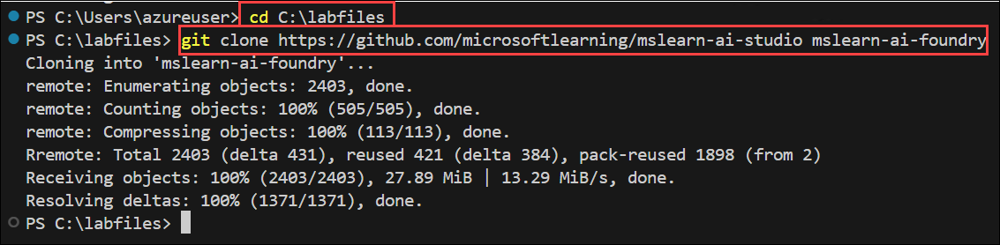

1. After the repo has been cloned, Click on **Explorer (1)** then **open the folder (2)** in VS Code, and navigate to the **`C:\labfiles` (3)** then select the folder **mslearn-ai-foundry` (4)** and click on **Select Folder (5)**.

    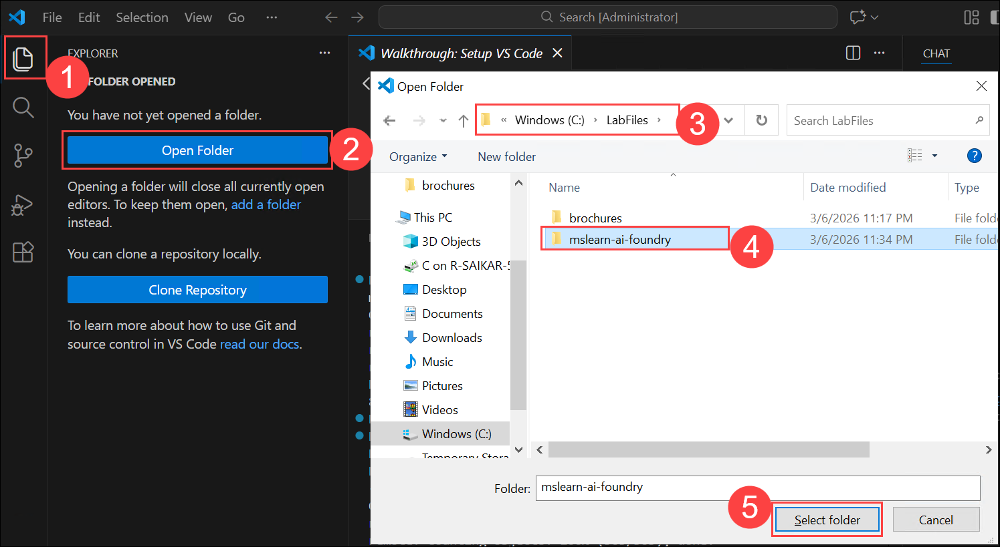

1. In the VS Code Explorer pane, navigate to **labfiles (1) > foundry-rag (2) > rag-app (3)** and review the files in the folder **(4)**:

    - `brochures`- the same folder of brochures you downloaded and extracted previously
    - `.env` - A configuration file for application settings.
    - `rag-app.py` - The Python code file for the RAG application.
    - `requirements.txt` - A file listing the package dependencies.

      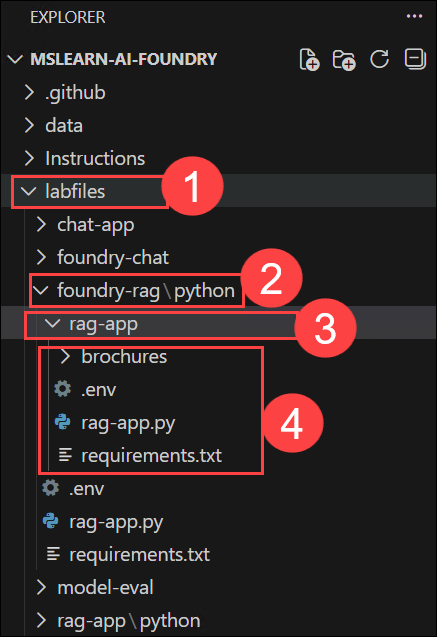

1. In the Explorer pane, right-click the **rag-app (1)** folder containing the application files, and select **Open in integrated terminal (2)**.

      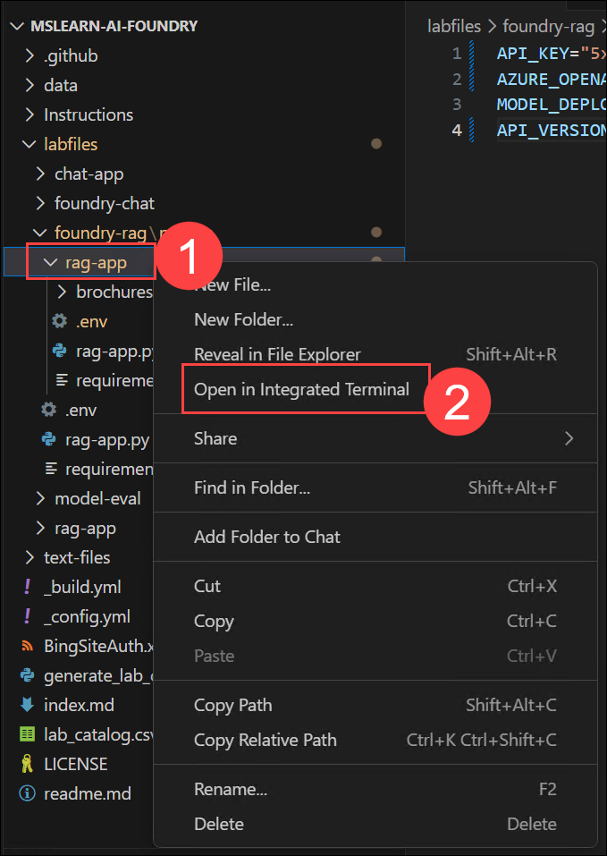

1. Now lets install the OpenAI SDK package and other required packages by running the following command:

    ```
    pip install -r requirements.txt
    ```
     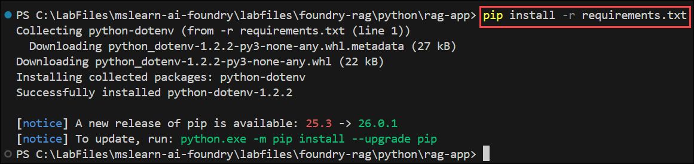

1. In VS Code, open the **`.env`** file, replace the placeholders and then Save the **`.env`** file.:    
    ```
    API_KEY="your_api_key"
    AZURE_OPENAI_ENDPOINT="your_azure_openai_endpoint"
    MODEL_DEPLOYMENT="gpt-4.1"
    API_VERSION = "your_azure_openai_version"
    ```

     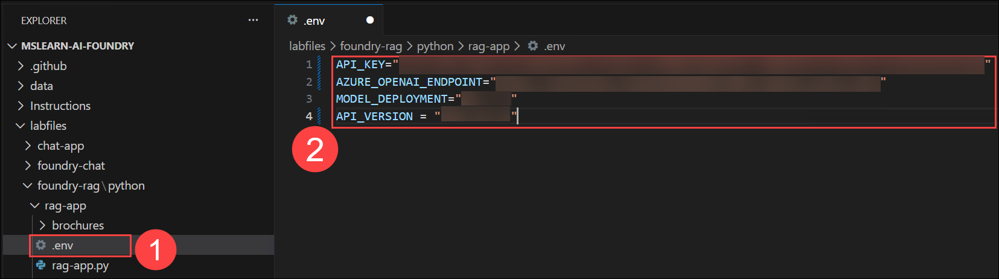

    > **Note**: If you deployed your gpt-4.1 model to a different region due to insufficient quota, on the Models + Endpoints page, select your model and use its Target URI as your endpoint instead.

1. In the Explorer pane, in the **/labfiles/foundry-rag/python/rag-app** folder, select the **`rag-app.py`** file to open it. Review the existing code. You will add code to use the OpenAI SDK to access your model.

1. At the top of the code file, under the existing namespace references, find the comment Import namespaces and add the following code to import the namespace you will need to use the OpenAI SDK:

    ```
    # import namespaces
    from openai import OpenAI
    ```
    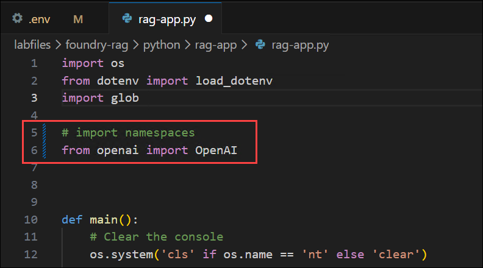

1. In the main function, note that code to load the endpoint and key from the configuration file has already been provided. Then find the comment Initialize the OpenAI client, and add the following code to create a client for the OpenAI API:

    ```
    # Initialize the OpenAI client
    openai_client = OpenAI(
    base_url=azure_openai_endpoint,
    api_key=api_key
    )
    ```
    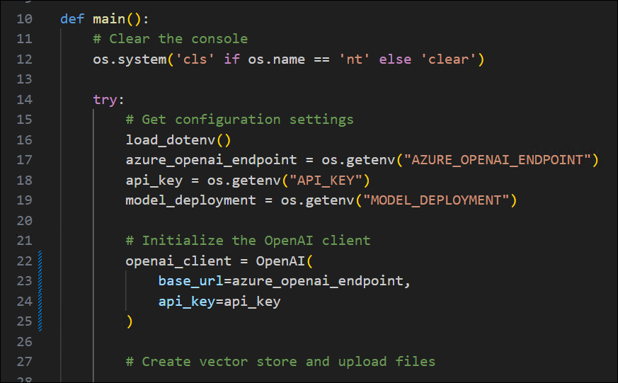

1. In the mainfunction, find the comment Create vector store and upload files, and add the following code. This code creates a vector store for your model, and uploads the brochures to it.

    ```
    # Create vector store and upload files
    print("Creating vector store and uploading files...")
    vector_store = openai_client.vector_stores.create(
        name="travel-brochures"
    )
    file_streams = [open(f, "rb") for f in glob.glob("brochures/*.pdf")]
    if not file_streams:
        print("No PDF files found in the brochures folder!")
        return
    file_batch = openai_client.vector_stores.file_batches.upload_and_poll(
        vector_store_id=vector_store.id,
        files=file_streams
    )
    for f in file_streams:
        f.close()
    print(f"Vector store created with {file_batch.file_counts.completed} files.")
    ```
    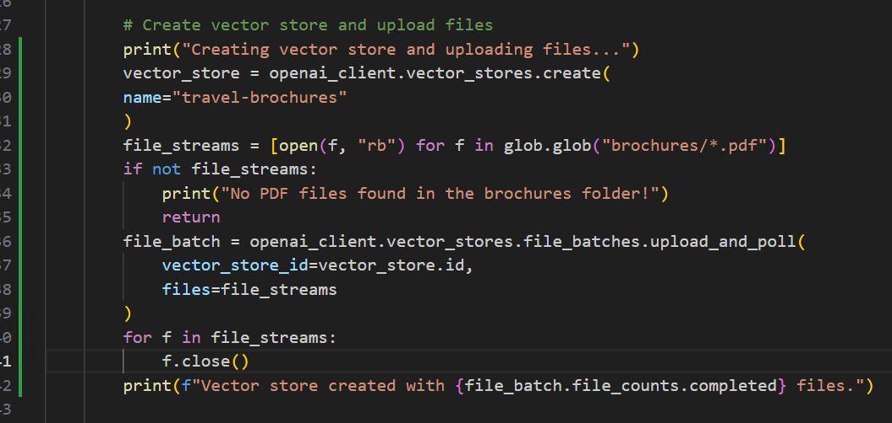

1. In the main function, note that code to request a user prompt until the user quits the app has been provided. Within this loop, find the Get a response comment, and add the following code.This code submits a prompt and specifies that the file_search tool can be used to search the vector store.

    ```
    # Get a response
    response = openai_client.responses.create(
    model=model_deployment,
    instructions="You are a travel assistant that provides information on travel services available from Margie's Travel. Only answer questions based on the provided travel brochure data.",
    input=input_text,
    previous_response_id=last_response_id,
    tools=[{
        "type": "file_search",
        "vector_store_ids": [vector_store.id]
        }]
    )
    print(response.output_text)
    last_response_id = response.id
    ```
    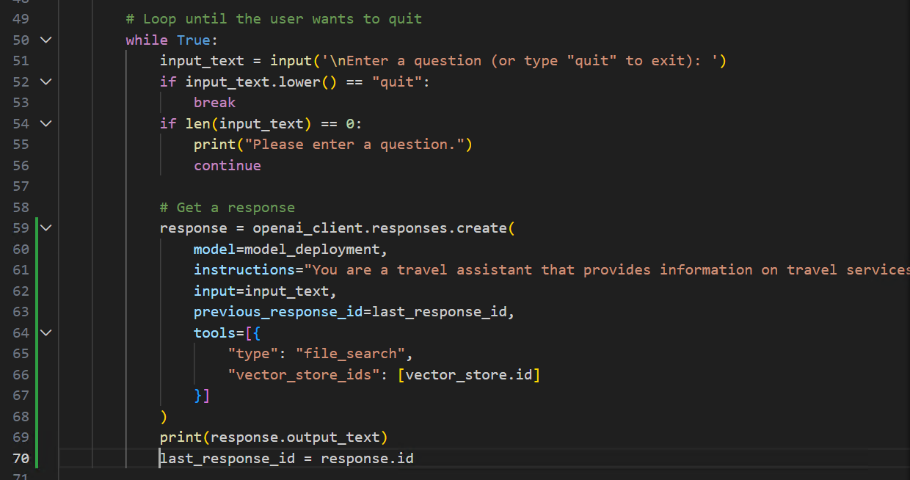

1. Final code should look like the following:

    ```
    import os
    from dotenv import load_dotenv
    import glob

    # import namespaces
    from openai import OpenAI

    def main(): 
        # Clear the console
        os.system('cls' if os.name == 'nt' else 'clear')

        try:
            # Get configuration settings 
            load_dotenv()
            azure_openai_endpoint = os.getenv("AZURE_OPENAI_ENDPOINT")
            api_key = os.getenv("API_KEY")
            model_deployment = os.getenv("MODEL_DEPLOYMENT")

            # Initialize the OpenAI client
            openai_client = OpenAI(
                base_url=azure_openai_endpoint,
                api_key=api_key
            )

            # Create vector store and upload files
            print("Creating vector store and uploading files...")
            vector_store = openai_client.vector_stores.create(
            name="travel-brochures"
            )
            file_streams = [open(f, "rb") for f in glob.glob("brochures/*.pdf")]
            if not file_streams:
                print("No PDF files found in the brochures folder!")
                return
            file_batch = openai_client.vector_stores.file_batches.upload_and_poll(
                vector_store_id=vector_store.id,
                files=file_streams
            )
            for f in file_streams:
                f.close()
            print(f"Vector store created with {file_batch.file_counts.completed} files.")

            # Track conversation state
            last_response_id = None

            # Loop until the user wants to quit
            while True:
                input_text = input('\nEnter a question (or type "quit" to exit): ')
                if input_text.lower() == "quit":
                    break
                if len(input_text) == 0:
                    print("Please enter a question.")
                    continue

                # Get a response
                response = openai_client.responses.create(
                    model=model_deployment,
                    instructions="You are a travel assistant that provides information on travel services available from Margie's Travel. Only answer questions based on the provided travel brochure data.",
                    input=input_text,
                    previous_response_id=last_response_id,
                    tools=[{
                        "type": "file_search",
                        "vector_store_ids": [vector_store.id]
                    }]
                )
                print(response.output_text)
                last_response_id = response.id
                
        except Exception as ex:
            print(ex)

    if __name__ == '__main__': 
        main()

    ```
    > **Note**: Please verify for the indundation errors before running the app.

1. Save the file **(Ctrl+S)**.

## Task 5: Run the RAG application

1. After saving the RAG code successfully, in the same terminal lets run the application:

    ```
    python rag-app.py
    ```
1. When prompted, enter a question and review the response from your generative AI model.

    ```
    Where should I go on vacation to see architecture?
    ```

1. Note that the response should include information grounded in the travel brochure data, with references to the source documents.

1. Try a follow-up question, for example as below given prompt and observe the response.

    ```
    Where can I stay there?
    ```

1. When you’re finished, enter quit to exit the program.

## Summary

In this lab, you have accomplished the following:
- Provisioned an Azure OpenAI resource.
- Deployed an Azure OpenAI model within the Microsoft Foundry.
- Used the chat playground to utilise the functionalities of prompts, parameters, and code generation.

### Conclusion

By completing this hands-on lab, you’ve gained practical experience with Azure OpenAI Service and Microsoft Foundry. You started by provisioning an Azure OpenAI resource and deploying a model that supports both conversational and instruction-based scenarios. You then explored the Chat playground, experimenting with prompts, parameters, and few-shot examples to shape model responses. Finally, you tested the model’s ability to generate code, highlighting its potential for developer productivity.

These exercises introduced not just the mechanics of deploying and interacting with models, but also how to configure them for different use cases, whether that’s conversational AI, educational Q\&A, or programming assistance. With this foundation, you’re now better equipped to integrate Azure OpenAI into real-world applications that demand scalability, flexibility, and secure access through the Azure ecosystem.

### You have successfully completed the Hands-on lab!
